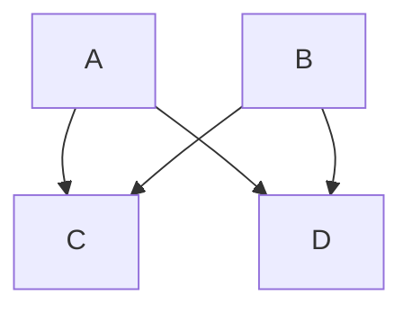

# - $\lambda$ lambda-thinking
Journal, tutorials and more

## Daily Commits
I'm generally do some kind of development on a daily basis which is just in the spirit of learning new technologies or ideas. I am really bad at making daily commits on these activities and so I am going to try a challenge of committing code and pushing up for others to see.

### Testing out emoji's
[emoji-cheat-sheet](https://github.com/ikatyang/emoji-cheat-sheet/blob/master/README.md)

:grinning:

### Adding mermaid 

> [Mermaid](https://mermaid-js.github.io/mermaid/#/README) lets you create diagrams and visualizations using text and code.
> It is a JavaScript based diagramming and charting tool that renders Markdown-inspired text definitions to create and modify diagrams dynamically.

[GitHubs Docs](https://docs.github.com/en/get-started/writing-on-github/working-with-advanced-formatting/creating-diagrams)

### Documentation for math support in markdown
[Github: Writing mathematical expressions](https://docs.github.com/en/get-started/writing-on-github/working-with-advanced-formatting/writing-mathematical-expressions)
This sentence uses `$` delimiters to show math inline:  $\sqrt{3x-1}+(1+x)^2$
