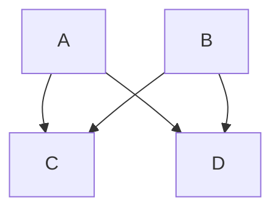

# λ lambda-thinking
Journal, tutorials and more

## Algorithms

- Search
    - [Summary](./docs/algorithms/search/index.md)
        - [Linear Search](./docs/algorithms/search/linearSearch.md) :sparkles:
        - [Jump Search](./docs/algorithms/search/jumpSearch.md) :sparkles:
        - [Binary Search](./docs/algorithms/search/binarySearch.md) :sparkles:
        - [Exponential Search](./docs/algorithms/search/exponentialSearch.md) :sparkles:

- Sorting
    - [Heap Sort](./docs/algorithms/sort/heapSort.md)

## Test Driven Development  :sparkles:
- [Intro](./docs/test-driven-development/index.md)
    - [Top Node.js testing frameworks](./docs/test-driven-development/TopNodejsTestingFrameworks.md) :sparkles:

## Big O Notation
- [Summary](./docs/bigONotation.md)

## Daily Commits
I'm generally do some kind of development on a daily basis which is just in the spirit of learning new technologies or ideas. I am really bad at making daily commits on these activities and so I am going to try a challenge of committing code and pushing up for others to see.

# Documentation Best practices

### Semantic Commit Messages

Moving forward to use [conventional commits](https://www.conventionalcommits.org/en/v1.0.0/#summary) for commit messages. A good example of [semantic commit messages](https://gist.github.com/joshbuchea/6f47e86d2510bce28f8e7f42ae84c716) on GitHub.

### Markdown Cheet Sheets
- [emoji-cheat-sheet](https://github.com/ikatyang/emoji-cheat-sheet/blob/master/README.md) :grinning:
- [Github: Writing mathematical expressions](https://docs.github.com/en/get-started/writing-on-github/working-with-advanced-formatting/writing-mathematical-expressions)
This sentence uses `$` delimiters to show math inline:  
``` markdown
$\sqrt{3x-1}+(1+x)^2$
```
Produces:

$\sqrt{3x-1}+(1+x)^2$
### Using charts in documentation

> [Mermaid](https://mermaid-js.github.io/mermaid/#/README) lets you create diagrams and visualizations using text and code.
> It is a JavaScript based diagramming and charting tool that renders Markdown-inspired text definitions to create and modify diagrams dynamically.

[GitHubs Docs](https://docs.github.com/en/get-started/writing-on-github/working-with-advanced-formatting/creating-diagrams)



[Semantic Versioning](https://semver.org)


